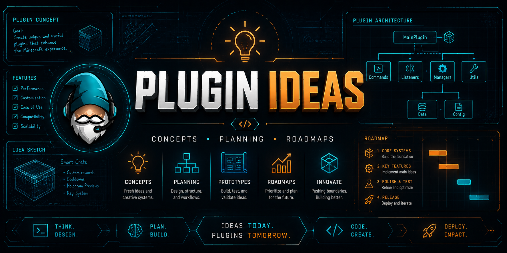

  

# Plugin Ideas

Minecraft plugin concepts, development notes, feature planning, and future project ideas for Warthawg Gaming.

---

## Purpose

This repository is used to organize:

- Plugin concepts
- Planned features
- Gameplay systems
- Server utility ideas
- Quality-of-life improvements
- Development roadmaps

---

## Current Focus

- Survival gameplay improvements
- Inventory management systems
- Automation plugins
- Server utilities
- Community features

---

## Planned Projects

- AutoHopper expansions
- Economy systems
- Teleport utilities
- Anti-grief tools
- Discord integrations
- Server management tools

---

## Status

Active planning and development.
